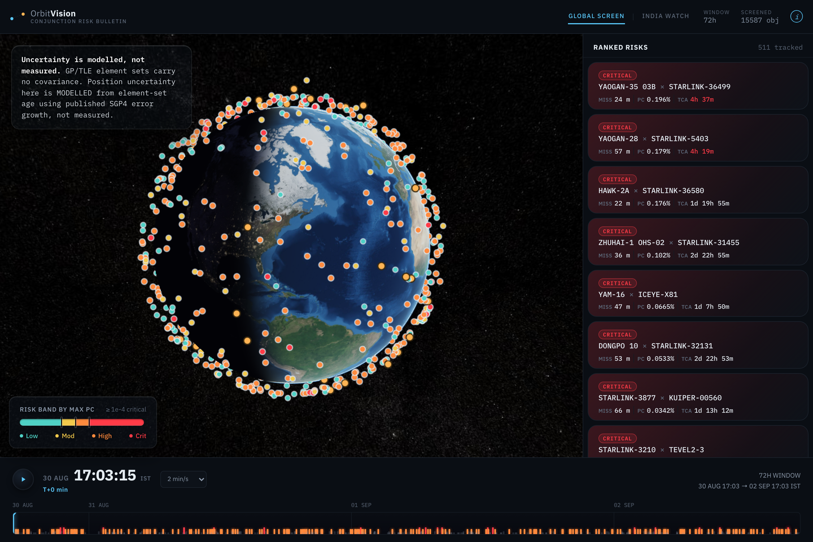

# OrbitVision

> A decision-support prototype for prioritising satellite conjunction risk in low Earth orbit.

[Live dashboard](https://sakshamkotecha05.github.io/OrbitVision/)



OrbitVision turns a public satellite catalogue into a ranked view of possible close approaches over the next 72 hours.
Instead of treating the closest pass as the highest risk, it ranks encounters by their maximum probability of collision, accounting for modelled uncertainty in the underlying orbital data.
The result is an interactive globe, a risk-ranked encounter list, and a dedicated India Watch screen for Indian-operated low Earth orbit satellites.

## Why it matters

Low Earth orbit contains working spacecraft, defunct satellites, rocket bodies, and debris, all travelling at orbital speeds.
A collision can destroy both objects and create a debris cloud that raises the risk for other missions.
Operators have limited opportunities and limited fuel to avoid an encounter, so they need to know which events are worth attention.

OrbitVision is designed to make that decision easier to inspect.

## What you can explore

- **Global Screen** shows a 3D view of the low Earth orbit catalogue alongside conjunctions ranked worst first.
- **Risk cards** show the two objects, miss distance, maximum collision probability, and time of closest approach.
- **Encounter selection** flies the globe to the event, highlights the relevant orbital paths, and moves the clock to just before closest approach.
- **Time scrub** animates the catalogue through the complete 72-hour prediction window.
- **India Watch** exhaustively screens Indian-operated low Earth orbit satellites against the full catalogue rather than filtering the global results afterward.
- **Probability-based bands** distinguish Critical, High, Moderate, and Low risk using maximum collision probability rather than a simple distance cutoff.

## How it works

| Stage | What OrbitVision does |
| --- | --- |
| 1. Ingest | Reads CelesTrak GP element sets and SATCAT metadata from the committed offline snapshot or a rate-limited live cache. |
| 2. Propagate | Uses SGP4 to predict low Earth orbit positions across a 72-hour window. |
| 3. Screen | Narrows a large catalogue through analytic, coarse spatial, and fine closest-approach checks. |
| 4. Score | Calculates Chan-method collision probability using modelled position uncertainty and hard-body radius. |
| 5. Prioritise | Collapses repeat encounters per object pair and ranks the worst event for each pair. |
| 6. Visualise | Writes a single JSON output that the Cesium-powered frontend renders as an interactive mission console. |

```text
CelesTrak catalogue → SGP4 propagation → three-stage screening → Chan Pc scoring
                                                                    ↓
                                                          data/output.json
                                                                    ↓
                                                   Cesium globe + ranked console
```

## Important scope and limitations

OrbitVision is a hackathon decision-support prototype, not an operational collision-warning service.

- It uses public CelesTrak data, not operator-grade tracking data.
- Position uncertainty is modelled from element-set age because public GP/TLE data does not include measured covariance.
- It covers low Earth orbit only, with objects above roughly 2,000 km apogee excluded.
- It does not send alerts, recommend manoeuvres, or connect to satellite-operator systems.
- Formation-flying encounters with too little relative motion for the collision model are screened out before scoring.

## Run locally

### Prerequisites

- Python 3.12 or a compatible Python 3 environment.
- Node.js 20 or later.

### 1. Install dependencies

```bash
pip install -r requirements.txt
npm install
```

### 2. Generate the orbital-risk data

Use the committed catalogue snapshot for repeatable local work.
This mode makes no network calls.

```bash
PYTHONPATH=src python -m orbitvision --offline --out data/output.json
```

The full offline run takes about five minutes against the committed snapshot.
Run it before starting Vite or creating a production bundle.
The committed `data/sample-output.json` documents the expected schema, but Vite copies `public/data` during a build and requires the generated output file to exist.

### 3. Start the dashboard

```bash
npm run dev
```

Open the local URL printed by Vite, normally `http://localhost:5173/`.

### Production build

```bash
npm run build
npm run preview
```

## Verify the engine

```bash
PYTHONPATH=src python tests/test_risk.py
```

The tests cover the Chan probability calculation, maximum-Pc ranking, risk-band thresholds, formation-flying screening, and the initial orbital filter.

## Data and risk model

- **Catalogue:** [CelesTrak](https://celestrak.org/) GP element sets and SATCAT metadata.
- **Propagation:** SGP4.
- **Probability of collision:** Chan's method on the Foster formulation.
- **Risk ranking:** maximum collision probability, not nominal probability or miss distance alone.
- **Uncertainty:** an explicit age-based model, disclosed in the interface and output data as modelled rather than measured.

The engine exports a single `data/output.json` file that the frontend consumes.

## Deployment

GitHub Actions builds the Python data output, bundles the Vite frontend, and deploys GitHub Pages whenever changes are merged into `main`.
The deployed project is available at [sakshamkotecha05.github.io/OrbitVision](https://sakshamkotecha05.github.io/OrbitVision/).

## Project structure

```text
src/orbitvision/  Python risk-analysis pipeline
src/              Cesium dashboard and client-side propagation
data/             Catalogue snapshot and generated risk output
public/           Static imagery and browser-served data
readme-assets/    Dashboard screenshot used in this README
.github/          Test and GitHub Pages workflows
```
